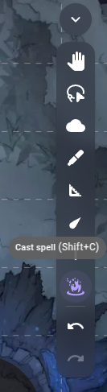
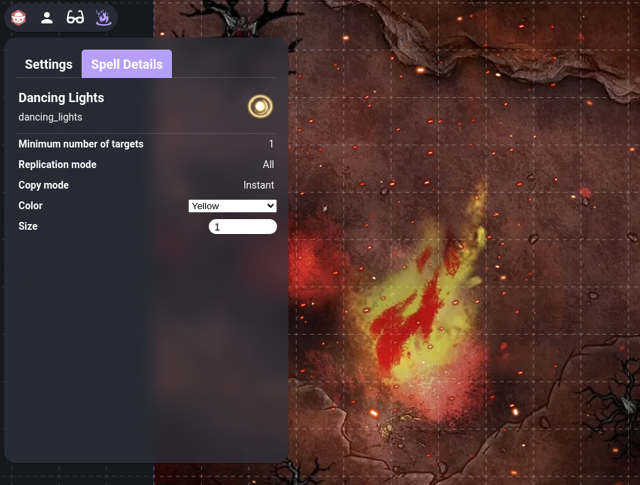

# 🔥 Embers
Embers is an Owlbear Rodeo extension that allows you to play animated spells and abilities. It uses the animated assets generously provided by [JB2A](https://jb2a.com/), under the Creative Commons License Attribution-NonCommercial CC BY-NC-SA ([click here](https://creativecommons.org/licenses/by-nc-sa/4.0/) to know more about this).

## How to use it
### Basic usage
To play a spell or ability effect with Embers, you can select the "Cast spell" tool on the tools panel, or press `shift+C`.

After this, you will enter the default "Add Targets" tool mode, which allows you to click on the scene and add targets to your spell. If you mess up, you can remove a target by selecting the "Remove Target" (or pressing `R`), and clicking on a target; you can then go back to adding more targets by clicking on the previous tool mode (or pressing `A`).
Once you are done selecting all your targets, you can select the spell you want to cast (by clicking on the "Select Spell" action or pressing `.`) and either click on the "Cast Selected Spell" tool action or press `Enter` to play the effect.

This image shows, from left to right: 
* Add Target (`A`)
* Remove Target (`R`)
* Cast Selected Spell (`Enter`)
* Select Spell (`.`)

### Effect Customization
When the "Cast spell" tool is activated, if Embers' action panel is opened, it will switch to the "Spell Details" tab and show the currently selected spell's properties. Some of these can be edited, like the color of some spells, and will immediately take effect.

### API
Embers exposes most of its capabilities through the Owlbear Rodeo SDK's broadcasting functionality. However, since it is still in a heavy development stage, the documentation regarding this has not been published yet.

## Roadmap
These are some features that are on Embers' backlog:

- [x] Support basic projectiles/AOE effects
- [x] Support all spell effects from JB2A
- [ ] Support all generic effects from JB2A
- [ ] Implement all spells from D&D 5e's Player Handbook ()
- [x] Support permanent effects
- [ ] Support custom metadata
- [x] Allow for custom spell parameters
- [ ] Implement the settings menu
- [ ] Save targets between castings (when option is enabled in settings)
- [ ] Enforce maximum and minimum number of targets specified in the spell's description
- [ ] Allow players to control their own permanent effects (not just the GM)
- [ ] Create the UI for creating custom spells
- [ ] Allow some simple actions like moving tokens (for spells like Misty Step)
- [ ] Allow basic shader effects like changing colors, screen shake, etc

## Contacts
The easiest way to reach out to me about this extension is to join Owlbear Rodeo's [Discord Server](https://discord.gg/u5RYMkV98s) and message me at `armindoflores`.
