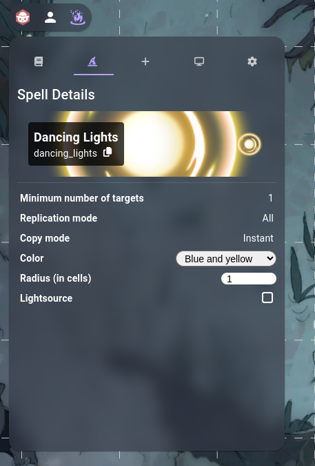

# 🔥 Embers
Embers is an Owlbear Rodeo extension that allows you to play animated spells and abilities. It uses the animated assets generously provided by [JB2A](https://jb2a.com/), under the Creative Commons License Attribution-NonCommercial CC BY-NC-SA ([click here](https://creativecommons.org/licenses/by-nc-sa/4.0/) to know more about this). Many thanks to [Aji Banawan](https://github.com/aaajii) for his work on Embers' UI.

## How to use it
### Basic usage
To play a spell or ability effect with Embers, you can select the "Cast spell" tool on the tools panel, or press `shift+C`.

After this, you will enter the default "Add Targets" tool mode, which allows you to click on the scene and add targets to your spell. If you mess up, you can remove a target by selecting the "Remove Target" (or pressing `R`), and clicking on a target, or remove all targets using the "Clear Selection" button (or pressing `X`); you can then go back to adding more targets by clicking on the previous tool mode (or pressing `A`).
Once you are done selecting all your targets, you can select the spell you want to cast (by clicking on the "Select Spell" action or pressing `.`) and either click on the "Cast Selected Spell" tool action or press `Enter` to play the effect.

This image shows, from left to right:
* Add Target (`A`)
* Remove Target (`R`)
* Cast Selected Spell (`Enter`)
* Select Spell (`.`)
* Clear Selection (`X`)

### Effect Customization
When the "Cast spell" tool is activated, if Embers' action panel is opened, it will switch to the "Spell Details" tab and show the currently selected spell's properties. Some of these can be edited, like the color of some spells, and will immediately take effect.

### More Information
For more information, visit the [Embers website](https://embers.armindo.eu).
